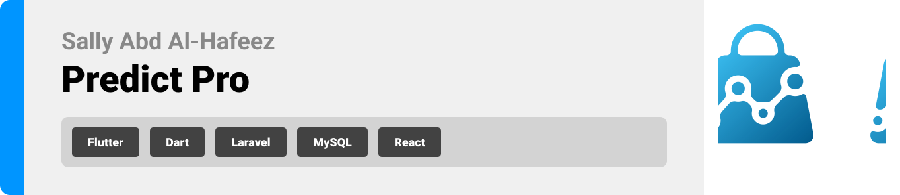

<br><br>

<!-- project philosophy -->


> The Predicate Pro is a web application specifically designed for supermarkets, in order to track and evaluate customer behavior. Its primary objective is to generate accurate forecasts to get the optimal product placement on shelves, recommendations for increased stock quantities, and identification of items that require inventory reduction. Furthermore, this application gives supermarkets access to detailed monthly reports and visual graphs, allowing them to closely monitor purchase trends and assess profitability. and that will be done using machine learning and artificial intelligence.

### User Stories
- As a Supermarket owner, I want to categorize Customers so that I can filter behavior data.
- As a Supermarket owner, I want to get Seasonal Predictions so that I can plan the inventory.
- As a Store manager, I want Inventory Reduction Suggestions so that I can receive recommendations for minimizing waste and improving profit.
- As a user I want to Create a Profile so that I can save my work and data.
- As a user I want to Edit my Profile so that I can change my info.


<br><br>

<!-- Prototyping -->
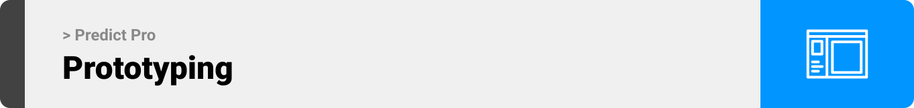

> We designed Predict Pro using wireframes and mockups, iterating on the design until we reached the ideal layout for easy navigation and a seamless user experience.

### Wireframes
| Login screen  | Register screen |  Main screen |
| ---| ---| ---|
| 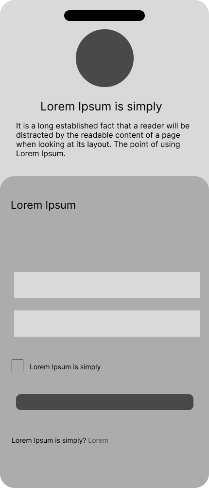 | 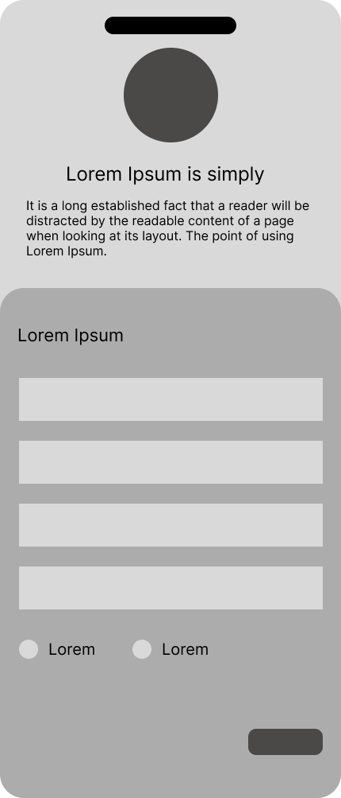 | 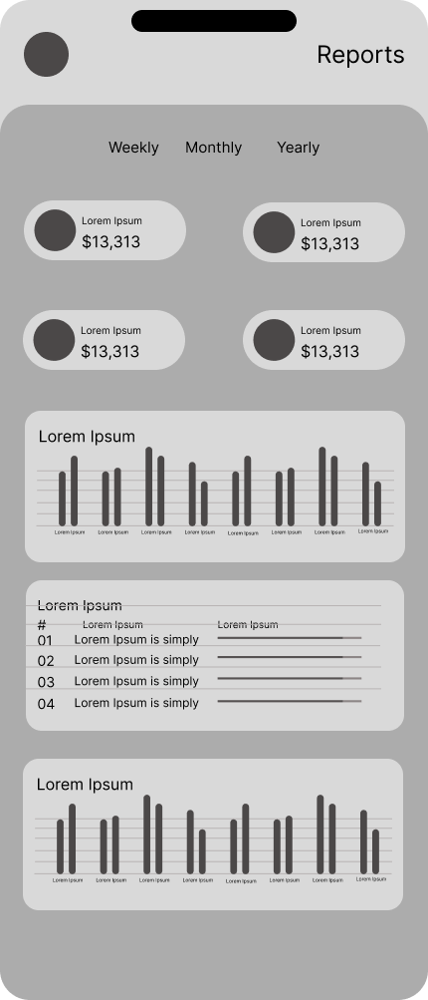 |

### Mockups
| Login screen  | Register screen |  Main screen |
| ---| ---| ---|
| 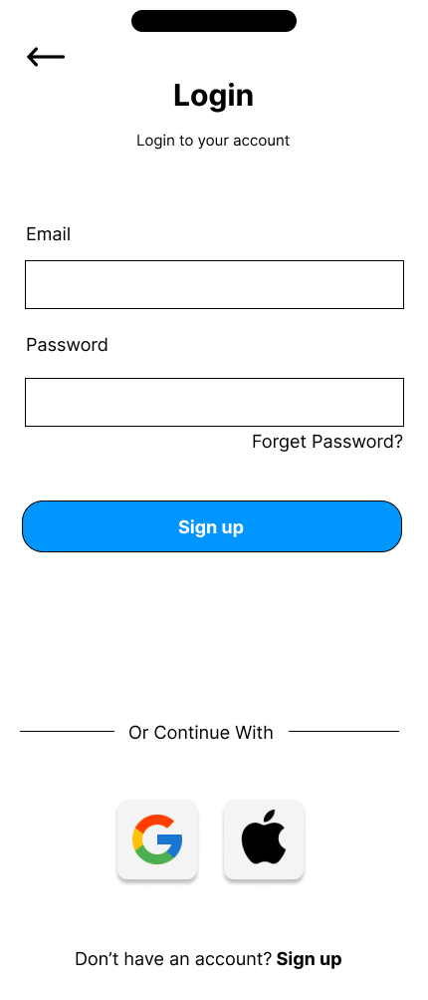 | 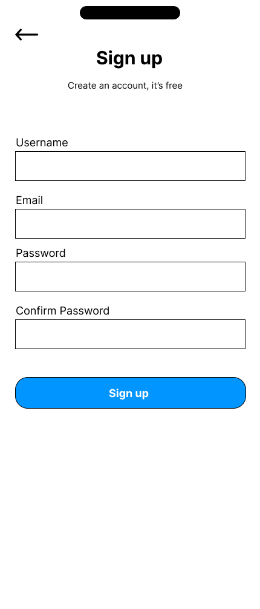 | 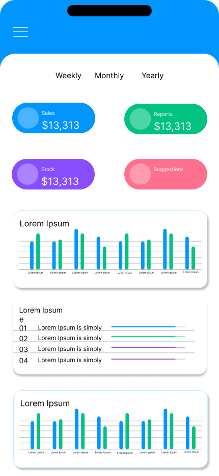 |

<br><br>

<!-- Implementation -->
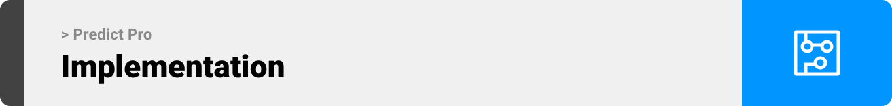

> Using the wireframes and mockups as a guide, we implemented the Predict Pro app with the following features:

### User Screens (Mobile)
| Login screen  | Register screen | Landing screen | Loading screen |
| ---| ---| ---| ---|
| 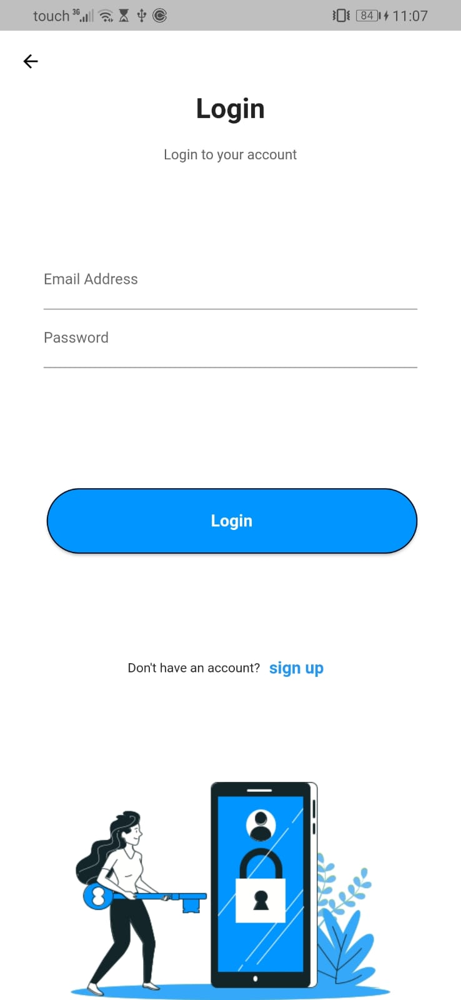 | 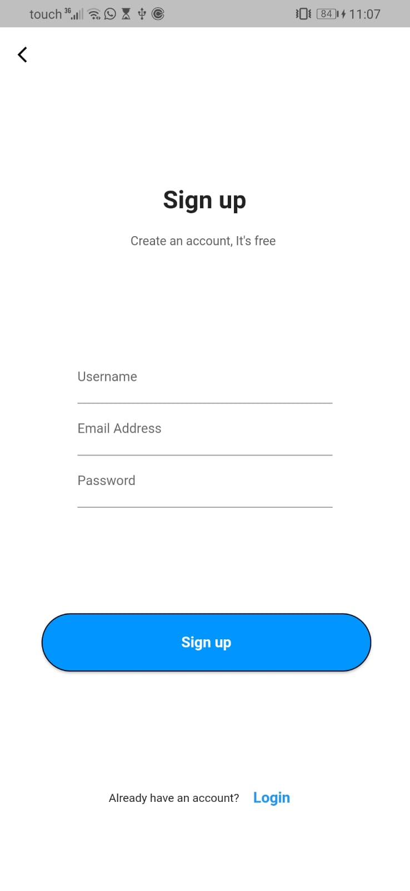 | 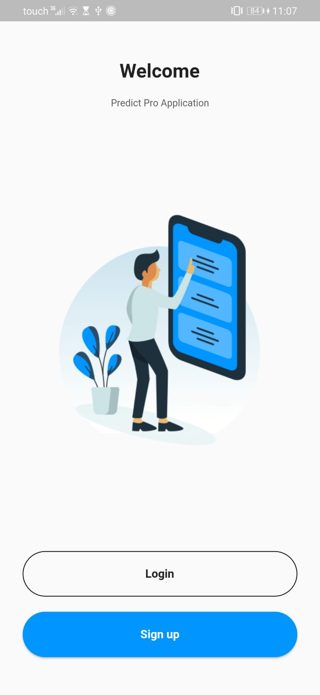 | 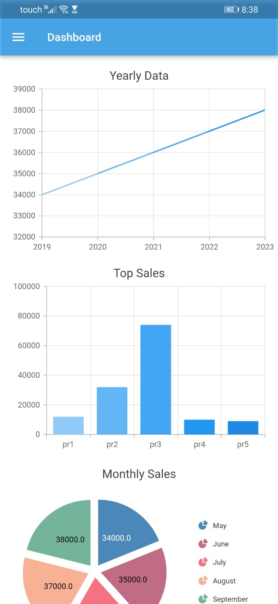 |
| Dashboard  | Stock Screen | Chat Screen | Login/Sign up Screen |
|  | .gif) | .gif) | 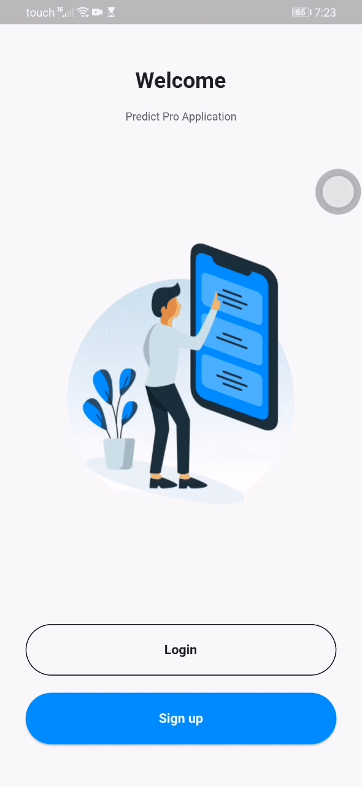 |

### User Screens (Admin)
| Landing screen | USers screen |
| ---| ---|
| 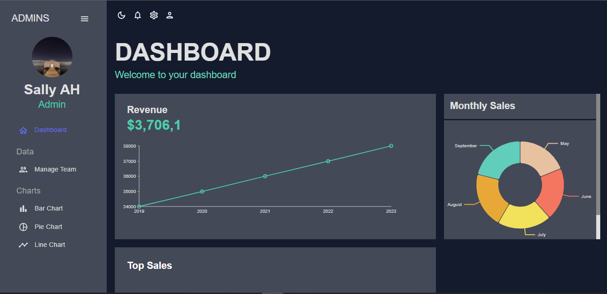 | 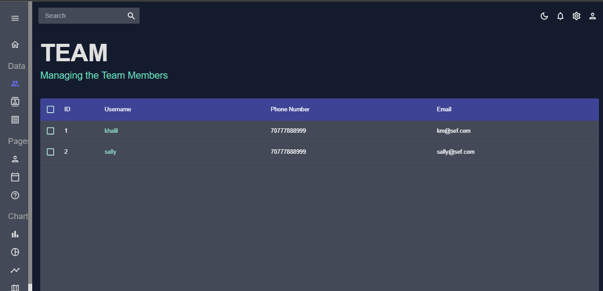 |

| Light Mode Landing screen | Light Mode USers screen |
| ---| ---|
| 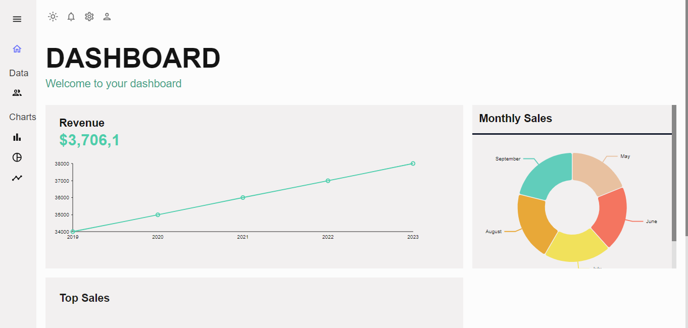 |  |

| Pie Chart screen | Bar Chart screen | Line Chart screen |
| ---| ---| ---|
| 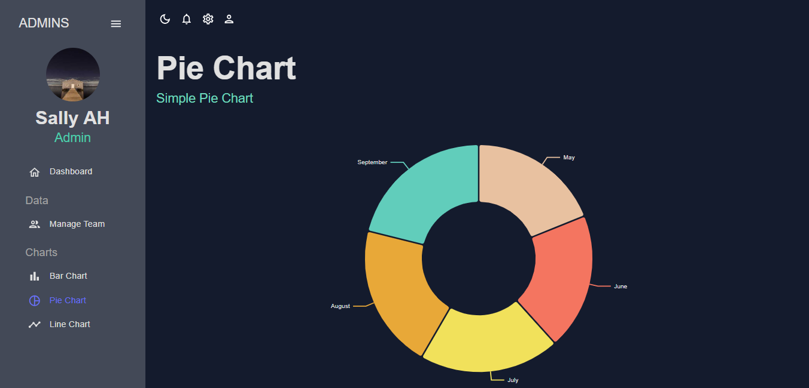 | 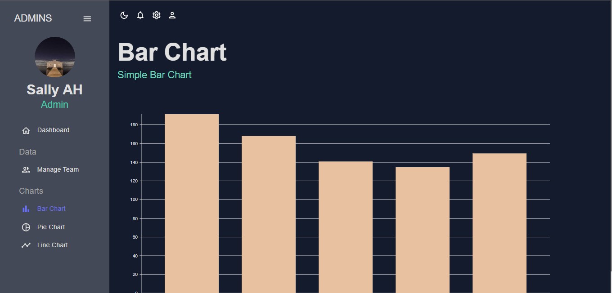 | 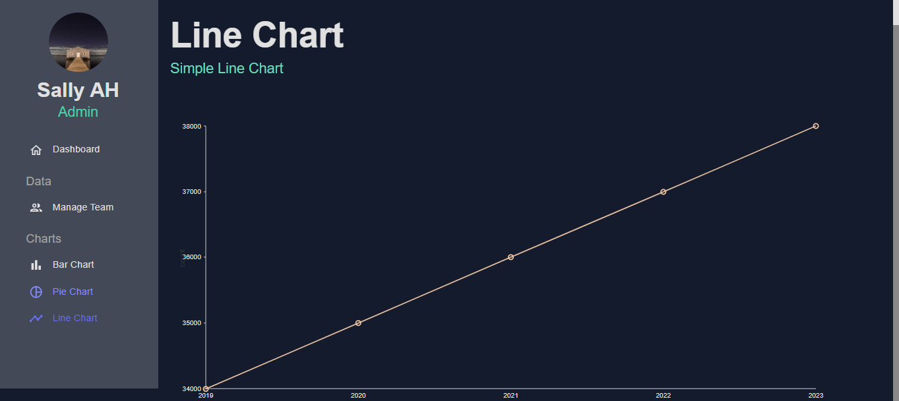 |

<br><br>

<!-- Tech stack -->
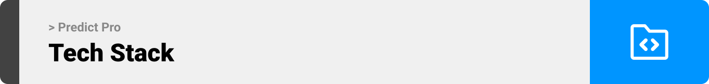

###  Predict Pro is built using the following technologies:

#### Frontend Development:
The Fatal Breath app is built using Flutter app development framework. Flutter enables the development of cross-platform mobile applications with a single codebase, allowing it to run seamlessly on various devices, including mobile, desktop, and web.

#### Backend Development:
For the backend, Laravel is used. Laravel is a robust PHP framework known for its elegant syntax and powerful features, making it ideal for building efficient and secure server-side applications.

#### Database Management:
The application relies on MySQL for database management. MySQL is a widely used open-source relational database management system that ensures data is stored and retrieved efficiently.

#### Real-time Chat:
To facilitate real-time communication among users, Firebase Realtime Database is integrated. Firebase is a Google-backed platform that offers real-time database capabilities, making it perfect for features like live chatting within the app.

#### Notifications:
Firebase Cloud Messaging (FCM) is used for sending push notifications to users. FCM is a cross-platform messaging solution that ensures reliable message delivery across different devices.

<br><br>

<!-- How to run -->


> To set up Coffee Express locally, follow these steps:

### Prerequisites for Admin dashboard

* npm
  ```sh
  npm install npm@latest -g
  ```

### Prerequisites for the Mobile App
*  Flutter SDK: Install the Flutter SDK to build and run the mobile application.

### Installation


1. Clone the repo
   ```sh
   git clone https://github.com/your_username_/Project-Name.git](https://github.com/sally-AH/predict_pro_app.git
   ```
2. Install Laravel dependencies by navigating to the Laravel project directory:
   ```sh
   cd laravel-backend
   composer install
   ```
3. Run Laravel migrations to set up the database:
   ```js
   php artisan migrate
   ```
4. Navigate to the Flutter app directory:
   ```sh
   flutter pub get
    flutter run
   ```

Now, you should be able to run Coffee Express locally and explore its features.
