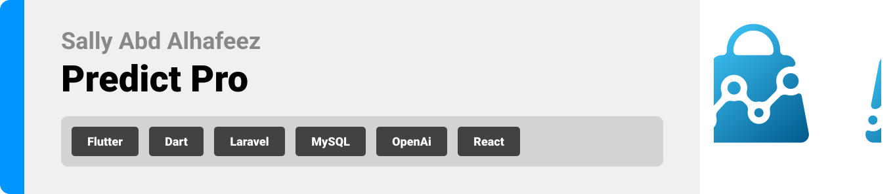
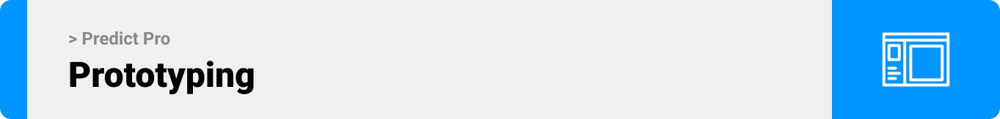
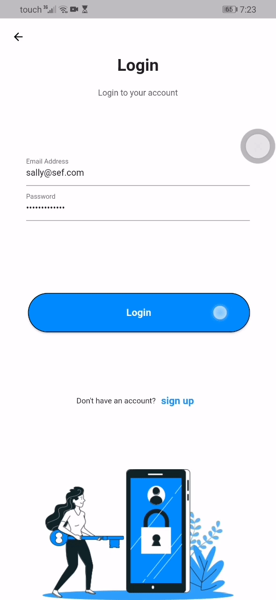
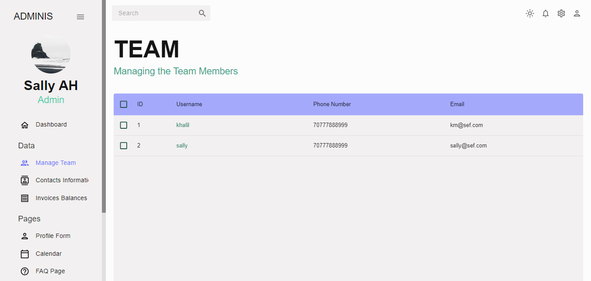
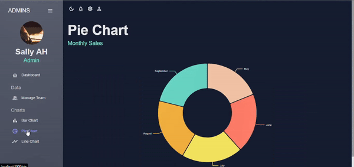

 
<br><br> 

 


- [Project Description](#project-description)
- [User Types](#user-types)
- [Features of the App](#features-of-the-app)
- [Tech Stack](#tech-stack)
  - [Frontend](#Frontend)
  - [Backend](#Backend)
- [Prototyping](#prototyping)
- [Demo](#Demo)
- [OpenAi](#OpenAi)
- [Performance](#Performance)
- [How to Run](#how-to-run)
  - [Prerequisites](#prerequisites)
  - [Installation](#installation)


<br><br>  

<!-- Project Description -->
<a name="project-description"></a>
 
> The Predicate Pro is a web application specifically designed for supermarkets, in order to track and evaluate customer behavior. Its primary objective is to generate accurate forecasts to get the optimal product placement on shelves, recommendations for increased stock quantities, and identification of items that require inventory reduction. Furthermore, this application gives supermarkets access to detailed monthly reports and visual graphs, allowing them to closely monitor purchase trends and assess profitability. and that will be done using machine learning and artificial intelligence.
<br>


### User Types 
1. Admin
2. Store Manager


### Features of the App

#### Admin Stories
- As an Admin, I want to categorize Customers so that I can filter behavior data.
- As an Admin, I want to get Seasonal Predictions so that I can plan the inventory.
- As an Admin, I want Inventory Reduction Suggestions so that I can receive recommendations for minimizing waste and improving profit.

#### Store Manager Stories
- As a Store Manager I want to Create a Profile so that I can save my work and data.
- As a Store Manager I want to Edit my Profile so that I can change my info.


<br><br>

<!-- Prototyping -->
<a name="prototyping"></a>


> We designed Predict Pro using wireframes and mockups, iterating on the design until we reached the ideal layout for easy navigation and a seamless user experience.

### Wireframes
| Login screen  | Register screen |  Main screen |
| ---| ---| ---|
|  |  |  |

### Mockups
| Login screen  | Register screen |  Main screen |
| ---| ---| ---|
|  |  |  |

<br><br>

<!-- Tech stack -->
<a name="tech-stack" ></a>


###  Predict Pro is built using the following technologies:

<a name="Frontend" ></a>
#### Frontend Development:
The Predict Pro app is built using Flutter app development framework. Flutter enables the development of cross-platform mobile applications with a single codebase, allowing it to run seamlessly on various devices, including mobile, desktop, and web.

<a name="Backend" ></a>
#### Backend Development:
For the backend, Laravel is used. Laravel is a robust PHP framework known for its elegant syntax and powerful features, making it ideal for building efficient and secure server-side applications.

#### Database Management:
The application relies on MySQL for database management. MySQL is a widely used open-source relational database management system that ensures data is stored and retrieved efficiently.

#### Real-time Chat:
To facilitate real-time communication among users, Firebase Realtime Database is integrated. Firebase is a Google-backed platform that offers real-time database capabilities, making it perfect for features like live chatting within the app.

#### Notifications:
Firebase Cloud Messaging (FCM) is used for sending push notifications to users. FCM is a cross-platform messaging solution that ensures reliable message delivery across different devices.

<br><br>

<!-- Demo -->
<a name="Demo" ></a>


> Using the wireframes and mockups as a guide, we implemented the Predict Pro app with the following features:

### User Screens (Mobile)
| Login Screen  | Register Screen | Landing Screen | Loading Screen |
| ---| ---| ---| ---|
|  |  |  |  |


| Dashboard Screen | Stock Screen | Chat Screen | Login/Sign up Screen |
| ---| ---| ---| ---|
|  | .gif) | .gif) |  |

### User Screens (Admin)
| Landing Screen | Users Screen |
| ---| ---|
|  |  |

| Light Mode Landing Screen | Light Mode Users Screen |
| ---| ---|
|  |  |

| Pie Chart Screen | Bar Chart Screen | Line Chart Screen |
| ---| ---| ---|
|  |  |  |

| Light/Dark Mode | Team screen |
| ---| ---|
|  |  |

| Bar Chart Screen | Pie Chart Screen |
| ---| ---|
|  |  |


<br><br> 

<a name="OpenAi" ></a>

<br>

Before prediction:
```sh
{
  invoice_id: 1,
  branch_id: 1,
  date: 2032-03-01 06:25:44
  total: 103
}
```
<br>
After prediction: 

```sh 
  {
  "product": {
    "times of buying": {
        "Kimberly Snacks" => 3,
        "Clorox Snacks" => 25,
        "Kellogg's Snacks" => 74,
        "Hormel Household" => 8,
     }

  "total revenues": {
        "Kimberly Snacks" => 197.46,
        "Clorox Snacks" => 168.18,
        "Kellogg's Snacks" => 140.37,
        "Hormel Household" =>134.07,
     }
  },
"weekly revenues in each month": {
    "May 2023": {
      "Week 1": 580.6,
      "Week 2": 596.6,
      "Week 3": 509.6,
      "Week 4":  482.7,
      "Week 5":  355.6
    },
  },

  "monthly revenues": {
    "May 2023": 2614.2,
    "June 2023": 2614.2,
    "July 2023": 2614.2,
    "August 2023": 2614.2,
    "September 2023": 1357.5
  },
  "total revenues from all products": 3706.1,
  "top 5 products": {
   {
      "product" => "Kimberly Snacks",
      "revenue" => 191.46
    },
   {
      "product" => "Clorox Snacks",
      "revenue" => 168.18
    },

  }
}

```

<br><br> 


<a name="Performance" ></a>
 
> The following tests were conducted in Postman to assess the functionality of my application's primary APIs
<br>

URL: http://34.245.108.208/api/admin/getusers

```sh 
PASS  Response status code is 200
PASS  Response contains the users property
PASS  Each user in the users array has the required properties

```
<br>

URL: http://34.245.108.208/api/admin/prompt

```sh 
PASS  The product array length must be greater than zero
PASS  Response time is within acceptable range
PASS  Response status code is 200
PASS  Validate the structure of the 'product' object
```
<br>


<br><br> 


<!-- How to run -->
<a name="how-to-run" ></a>
 

> To set up Coffee Express locally, follow these steps:
### Prerequisites 
##### Admin dashboard

* npm
  ```sh
  npm install npm@latest -g
  ```

##### Mobile App
*  Flutter SDK: Install the Flutter SDK to build and run the mobile application.

### Installation


1. Clone the repo
   ```sh
   git clone https://github.com/your_username_/Project-Name.git](https://github.com/sally-AH/predict_pro_app.git
   ```
2. Install Laravel dependencies by navigating to the Laravel project directory:
   ```sh
   cd laravel-backend
   composer install
   ```
3. Run Laravel migrations to set up the database:
   ```js
   php artisan migrate
   ```
4. Navigate to the Flutter app directory:
   ```sh
   flutter pub get
    flutter run
   ```

Now, you should be able to run Coffee Express locally and explore its features.
